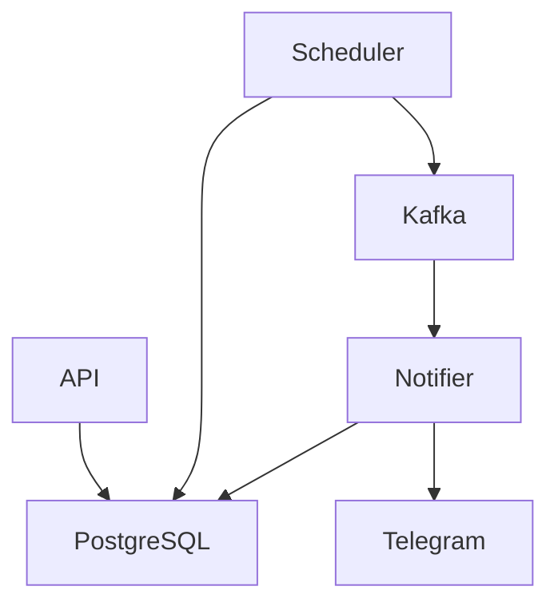

# Todo Go

Backend for tasks, assignment permissions, reminders, recurrence, notifications, and Telegram delivery. The project is intentionally small enough to run locally with one command, but includes production-like runtime pieces: separate API, scheduler, notifier, PostgreSQL, Kafka, Prometheus, and Grafana.

## Features

- Registration/login with JWT access tokens and hashed refresh tokens
- Tasks with creator/assignee permissions and status workflow
- Absolute and before-deadline reminders
- Recurring task series with generated task occurrences
- Internal notifications from due reminders via outbox and Kafka
- Optional Telegram notification delivery

## Stack

- Go, `net/http`, `slog`
- PostgreSQL, GORM, SQL migrations
- Kafka via `franz-go`
- Prometheus metrics and Grafana provisioning
- Docker Compose for local infrastructure

## Run

```bash
cp .env.example .env
go run ./cmd/dev
```

`cmd/dev` starts PostgreSQL and Kafka, waits for readiness, applies migrations, and runs API, Scheduler, and Notifier. Ctrl+C stops the local Go processes.

## Docker

```bash
cp .env.example .env
docker compose -f deploy/compose.yaml up --build
```

API is exposed on `localhost:8080`; Prometheus on `localhost:9090`; Grafana on `localhost:3000`.

## Tests

```bash
go vet ./...
go test ./...
go test -race ./...
golangci-lint run
```

## Architecture

The project uses hexagonal architecture and package-by-feature. Domain and application layers do not depend on HTTP, GORM, Kafka, or Telegram. Concrete adapters are wired manually in `internal/bootstrap`.



## Main services

- `cmd/api`: HTTP API, `/healthz`, `/readyz`, `/metrics`
- `cmd/scheduler`: reminder scheduler, recurrence scheduler, outbox relay
- `cmd/notifier`: Kafka consumer, internal notifications, optional Telegram delivery
